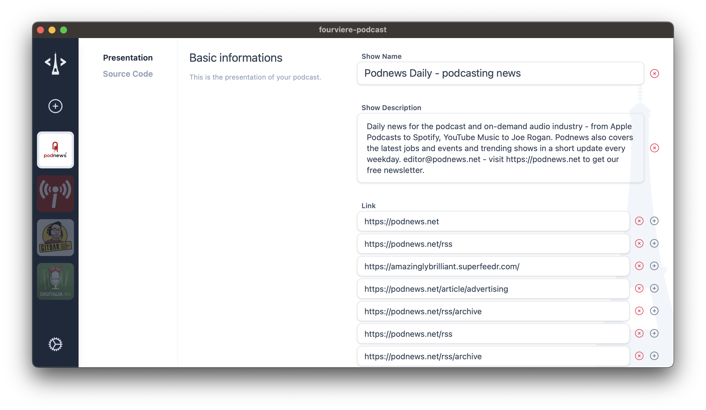

# Fourviere Podcast

Fourviere aims to be the most advanced RSS feed editor for open podcasting out there.

We all see that the world of podcasting is increasingly becoming a walled garden dominated by big players, so returning to its roots, the RSS feed, is both a political act and a matter of survival. To achieve this, we need to create software that meets all the requirements of modern software in terms of functionality, aesthetics, and ease of use, while under the hood, it has a heart made of XML.

The features that Fourviere offers include:

- Creation of RSS feeds with the ability to support all the parameters of podcasting 2.0
- Uploading the feed and assets to S3 or FTP to decouple the creation of the podcast from its hosting (a practice often pushed by hosting providers for feeds). By doing this, we can host our feed on any web space, on a personal server, or even on more advanced cloud providers.
- File editing and transformation features: creation of chapters and store it in the json file and the multimedia file in the form of ID3V2 tags, integration with Podcast Index web services, ChatGPT for creating episode notes, and integrated transcription function.
- Native video tag support: It will be possible to configure the embedded tag for the video quickly, as well as upload the video with the same simplicity. Thanks to the power of FFMPEG integrated into the application, it will also be possible to compress and encode the video and audio files automatically.

## Prequisites
### MacOS
1. Install [brew](https://brew.sh/)
2. brew install pkg-config 
3. brew install ffmpeg

### Windows
TODO

## Bootstrap the project

- Install [Node.js](https://nodejs.org/en) and [Rust](https://www.rust-lang.org/)
- Clone the repository
- Run `npm install` from the project's root folder
- Run `npm run dev` from the projects root folder

